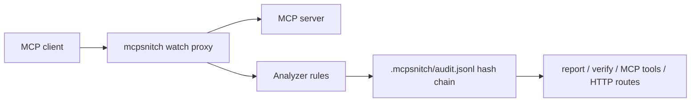

# MCPSnitch

**See what MCP tools are doing before you trust them.** MCPSnitch sits between an MCP client and server, records visible tool calls, flags suspicious file/network/secret flows, and writes a verifiable session report.

```bash
# Works now from the public GitHub release/package source:
npx -y github:rudycelekli/mcpsnitch analyze '{"jsonrpc":"2.0","id":1,"method":"tools/call","params":{"name":"summarize","arguments":{"url":"https://example.com","token":"API_KEY=abc"}}}' --json
npx -y github:rudycelekli/mcpsnitch report --json
npx -y github:rudycelekli/mcpsnitch verify --json
```

After npm publication, the same commands shorten to `npx mcpsnitch ...`.

> v0.1 is **visibility, not prevention**. It observes MCP JSON-RPC traffic that passes through it; it does not sandbox server syscalls or guarantee all exfiltration is caught.

## What changes

Before: `npx random-mcp-server` is a black box.  
After: `mcpsnitch watch -- npx random-mcp-server` leaves `.mcpsnitch/audit.jsonl`, `.mcpsnitch/report.json`, and anomaly findings you can inspect or verify.

## Benchmark claim

Current bundled benchmark (`npm run bench`) compares raw JSON parsing/forwarding with the MCPSnitch analyzer on 1,000 seeded MCP tool-call traces.

| Metric | Raw | MCPSnitch | Delta |
|---|---:|---:|---:|
| p99 latency | 0.0018ms | 0.0615ms | 0.0597ms (<5ms pass) |

Anomaly precision on injected malicious calls: **1.000** (50 flagged / 50 malicious).

Run it locally:

```bash
npm run bench
cat bench/results/report.md
```

## Architecture



1. You run the MCP server through `mcpsnitch watch -- ...`.
2. MCPSnitch forwards traffic while tapping JSON-RPC messages.
3. `tools/call` messages are classified for scope, data flow, cost, and findings.
4. Events are appended to a hash-chained JSONL audit log.
5. CLI, HTTP, and MCP endpoints read the same log.

## CLI

```bash
mcpsnitch watch -- <mcp-server-command> [args...]
mcpsnitch analyze '<jsonrpc-message>' --json
mcpsnitch report --json
mcpsnitch verify --json
mcpsnitch serve --port 3333
mcpsnitch mcp
```

Exit codes: `0` ok, `1` findings or broken verification, `2` precondition/config error.

## Endpoint surface

HTTP:

- `POST /analyze`
- `GET /report`
- `POST /report`
- `GET /verify`

MCP operator tools:

- `snitch_analyze`
- `snitch_report`
- `snitch_verify_log`

## Limitations

- Observes line-delimited JSON-RPC stdio traffic in v0.1.
- Does not inspect kernel syscalls, child-process internals, or encrypted side channels.
- Cost is a deterministic byte-based estimate, not a provider bill.
- Rules are intentionally conservative and evidence-backed; they will miss clever attacks.

## Prior art & credits

MCPSnitch follows the REGENTICS project-factory patterns proven in ProofSeal and AgentCanary: ADR-first scope, endpoint tests, benchmark-generated claims, and tamper-evident logs. The lineage is inspired by the ruflo/RuVector/ruvnet ecosystem patterns for witness chains and MCP tooling, with a clean MCPSnitch implementation authored by rudycelekli.
