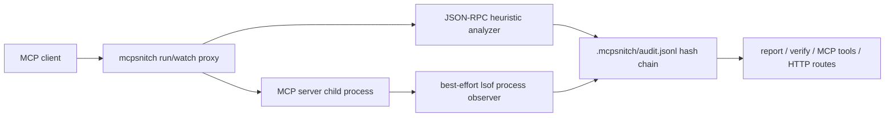

# MCPSnitch

**Developer preview: see what MCP tools *visibly* do before you trust them.** MCPSnitch sits between an MCP client and server, records visible MCP traffic, can add best-effort OS process observations, and writes a verifiable session report.

```bash
# Works now from the public GitHub release/package source:
npx -y github:rudycelekli/mcpsnitch run -- <mcp-server-command> [args...]
npx -y github:rudycelekli/mcpsnitch analyze '{"jsonrpc":"2.0","id":1,"method":"tools/call","params":{"name":"summarize","arguments":{"destinationUrl":"https://example.com","token":"sk-abcdefghijklmnopqrstuvwxyz"}}}' --json
npx -y github:rudycelekli/mcpsnitch report --json
npx -y github:rudycelekli/mcpsnitch verify --json
```

After npm publication, the same commands shorten to `npx mcpsnitch ...`.

> **Honesty line:** MCPSnitch v0.1.x logs and heuristically flags what is visible in MCP JSON-RPC traffic, plus best-effort sampled `lsof` observations of the child process when available. It is **observability and a tripwire, not a sandbox**. A malicious MCP server can evade JSON keyword/structure heuristics, can perform side effects inside its own process, and can hide behavior that is not visible to the proxy or sampled process observer.

## What changes

Before: `npx random-mcp-server` is a black box.  
After: `mcpsnitch run -- npx random-mcp-server` silently forwards clean traffic, auto-matches a built-in profile when it recognizes the server, writes `.mcpsnitch/audit.jsonl`, and prints a single actionable stderr alert only when something medium/high crosses the line. `mcpsnitch watch` remains available as the more verbose diagnostic proxy.

## Benchmark claim

Current bundled benchmark (`npm run bench`) compares raw JSON parsing/forwarding with the MCPSnitch JSON-RPC analyzer on 1,000 seeded MCP tool-call traces. The corpus includes benign scary words to measure false positives and encoded malicious cases to show the JSON heuristic's honest recall limit.

| Metric | Raw | MCPSnitch | Delta |
|---|---:|---:|---:|
| p99 latency | 0.0022ms | 0.1039ms | 0.1017ms (<5ms pass) |

Current generated detection evidence:

- Precision on flagged calls: **1.000** (100/100)
- Benign false-positive rate: **0.000** (0/850)
- Visible malicious heuristic recall: **1.000**
- All malicious heuristic recall, including encoded evasive cases: **0.667**

Run it locally:

```bash
npm run bench
cat bench/results/report.md
npm run bench:false-positive
cat bench/results/false-positive-report.md
npm run bench:process
cat bench/results/process-observer-report.md
```

The false-positive harness is profile-contextual: legitimate GitHub/fetch/search/database network sockets are informational under network-capable profiles, while the same socket under `filesystem`/`generic` remains alerting.

Profile-contextual false-positive harness: **0.000** benign alerting rate (0/6) and **1.000** detection on the included malicious fixtures.

Live process-observer harness: **0.000** benign alerting rate and **1.000** malicious fixture detection against real child processes with real held files/sockets. Short-lived socket observed: **false** (informational sampling-limit check).

## Architecture



1. You run the MCP server through `mcpsnitch run -- ...` (silent when clean) or `mcpsnitch watch -- ...` (diagnostic).
2. MCPSnitch forwards traffic while tapping line-delimited JSON-RPC messages.
3. `tools/call` messages are classified for visible scope, data flow, cost, and heuristic findings.
4. When `lsof` is available, MCPSnitch samples the child process for open files and network sockets and records the sampling interval. If it is unavailable, MCPSnitch logs a high-severity self-report-only downgrade event.
5. Events are appended to a hash-chained JSONL audit log.
6. CLI, HTTP, and MCP endpoints read the same log.

## Product behavior

`mcpsnitch run -- <mcp-server-command> [args...]` is the default adoption path. It is designed for one-line MCP config wrappers:

- **Clean session:** stdout remains only the proxied MCP protocol; MCPSnitch emits no stderr of its own (wrapped server stderr may still pass through); audit evidence is still appended.
- **Real violation or trust downgrade:** stderr gets exactly the kind of line an engineer can act on, for example `MCPSNITCH ALERT severity=medium rule=observed_unexpected_network_connection source=process_observer profile="filesystem" observed="..." action="..."`.
- **Profiles:** `--profile auto` is the default and recognizes common GitHub, filesystem, fetch/search/browser, and database server command names. Use `--profile <builtin-or-json-path>` for explicit or long-tail servers.
- **Honesty:** disabling or losing the process observer records and alerts a self-report-only downgrade because JSON-RPC-only monitoring is easier for a malicious server to evade.

## CLI

```bash
mcpsnitch run -- <mcp-server-command> [args...]
mcpsnitch run --profile auto -- <mcp-server-command> [args...]
mcpsnitch run --profile filesystem -- <filesystem-mcp-server-command> [args...]
mcpsnitch run --verbose -- <mcp-server-command> [args...]
mcpsnitch watch --profile filesystem -- <mcp-server-command> [args...]
mcpsnitch watch --profile fetch -- <network-mcp-server-command> [args...]
mcpsnitch watch --no-process-observer -- <mcp-server-command> [args...]
mcpsnitch analyze '<jsonrpc-message>' --json
mcpsnitch observe --pid <pid> --profile github --json
mcpsnitch profiles --json
mcpsnitch profile:init --name slack --out .mcpsnitch/profiles/slack.json --allow-network --json
mcpsnitch profile:learn --root . --name learned-server --out .mcpsnitch/profiles/learned-server.json --json
mcpsnitch report --json
mcpsnitch verify --json
mcpsnitch serve --port 3333
mcpsnitch mcp
```

Exit codes: `0` ok, `1` findings or broken verification for reporting/verification commands, `2` precondition/config error. `run` and `watch` preserve the wrapped child process exit code so they can stay transparent in MCP client configs; use `report` in CI when findings should fail a build.

## Endpoint surface

HTTP:

- `GET /version`
- `POST /analyze`
- `GET /report`
- `POST /report`
- `GET /verify`
- `GET /profiles`

MCP operator tools:

- `snitch_analyze`
- `snitch_report`
- `snitch_verify_log`
- `snitch_profiles`

## Built-in profiles

Profiles make process-observer findings contextual instead of noisy:

- `generic` — locked-down default; network is unexpected.
- `filesystem` — ordinary file reads are expected; network and sensitive files are unexpected.
- `fetch` — network is expected; sensitive local files are unexpected.
- `github` — network is expected for GitHub/API behavior; sensitive local files are unexpected.
- `database` — network is expected for database connections; sensitive local files are unexpected.

List them with `mcpsnitch profiles --json`, `GET /profiles`, or MCP tool `snitch_profiles`. `mcpsnitch run` and `watch` default to `--profile auto`, which infers these profiles from common server command names (`server-github`, `server-filesystem`, search/fetch/browser servers, and database servers). For long-tail servers, create a custom JSON profile with `mcpsnitch profile:init`, use a profile path in `--profile ./profile.json`, or draft one from an audit log with `mcpsnitch profile:learn` and review it before use. Sensitive-file permission is never auto-learned.

## Threat model and limitations

What v0.1.x can honestly do:

- Transparently proxy line-delimited MCP stdio traffic.
- Record visible JSON-RPC tool calls and results.
- Flag structured suspicious inputs such as sensitive paths, URL destination fields on non-network tools, and secret-like values in secret-like fields.
- Sample the child process with `lsof` to record OS-visible open files and network sockets when the host permits it, with status events that disclose sampled mode or self-report-only downgrade. The live process harness measures this layer against real held sockets/files.
- Verify that the audit log was not edited after the fact.

What v0.1.x does **not** do:

- It does not prevent exfiltration.
- It does not sandbox syscalls.
- It does not guarantee detection of encoded destinations, encrypted traffic, short-lived sockets/file opens between samples, or behavior inside an opaque MCP server.
- Its JSON-RPC analyzer is a heuristic tripwire, not a security boundary.
- Cost is a deterministic byte-based estimate, not a provider bill.

## Prior art & credits

MCPSnitch follows the REGENTICS project-factory patterns proven in ProofSeal and AgentCanary: ADR-first scope, endpoint tests, benchmark-generated claims, and tamper-evident logs. The lineage is inspired by the ruflo/RuVector/ruvnet ecosystem patterns for witness chains and MCP tooling, with a clean MCPSnitch implementation authored by rudycelekli.
