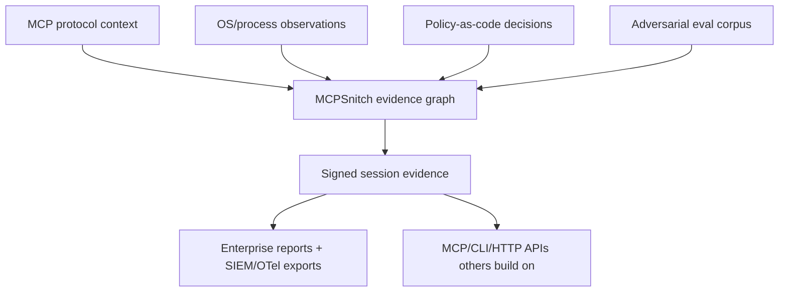

# MCPSnitch world-class differentiation bar

Status: release-blocking charter  
Date: 2026-06-13

MCPSnitch must not ship as a commodity MCP proxy, keyword scanner, or generic audit logger. The target is category-defining runtime security/observability for MCP: a control plane that Codex, Claude Code, and enterprise agent platforms would plausibly want built in.

## Current landscape reality

The market is not empty. The relevant categories are:

1. **MCP security guidance and best-practice checklists**
   - Official MCP security best practices: https://modelcontextprotocol.io/docs/tutorials/security/security_best_practices
   - NSA MCP security design guidance emphasizes robust audit logging and traceable sequences of actions: https://www.nsa.gov/Portals/75/documents/Cybersecurity/CSI_MCP_SECURITY.pdf
2. **Static / pre-deployment MCP scanners**
   - `mcp-scan` scans installed MCP server manifests and flags supply-chain/tool-poisoning risk: https://stytch.com/blog/mcp-scan/
   - MCPSafetyScanner performs agentic safety assessment of arbitrary MCP servers: https://arxiv.org/abs/2504.03767
   - `mcpserver-audit` focuses on community safety review: https://github.com/ModelContextProtocol-Security/mcpserver-audit
3. **Enterprise gateways / proxies**
   - MCP proxy/gateway writing is already common: https://obot.ai/blog/the-value-of-an-mcp-proxy-security-control-and-observability-for-enterprise-ai/
   - Gateway vendors emphasize access control, governance, audit logging, and rate controls.
4. **Runtime security advice**
   - Runtime hardening guidance increasingly calls for containment, strict permissions, and logging: https://www.redhat.com/en/blog/mcp-security-logging-and-runtime-security-measures

Therefore, MCPSnitch's differentiation cannot be "we proxy and log MCP." That is table stakes.

## Category-defining wedge

MCPSnitch wins only if it combines all four layers into one open, verifiable runtime product:

The differentiated product is **not** a scanner. It is a runtime evidence layer that correlates:

- what the MCP client asked for,
- what the MCP server claimed it was doing,
- what the child process actually did at the OS layer,
- whether that behavior matched policy,
- and a tamper-evident proof of the session.

## Non-negotiable release bar

Before any stable release or npm announcement:

1. **Honesty first**
   - No claim of prevention unless enforcement exists.
   - Every finding declares its evidence layer: `jsonrpc_heuristic`, `process_observer`, `syscall_observer`, `policy_engine`, etc.
2. **200+ test target if needed**
   - Unit, integration, endpoint, adversarial, regression, cross-platform, and benchmark tests.
   - Tests must hit real CLI/MCP/HTTP endpoints, not just internal functions.
3. **False-positive and false-negative harness**
   - Benign corpus from real MCP servers.
   - Malicious visible, encoded, delayed, short-lived socket, and tool-poisoning fixtures.
   - Public metrics: precision, false-positive rate, visible recall, total recall by layer, and p99 overhead.
4. **Process/OS layer becomes real**
   - v0.1.1 `lsof` sampling is a preview only.
   - Category-defining version needs deeper platform observers:
     - macOS EndpointSecurity or DTrace-compatible fallback where possible,
     - Linux eBPF/auditd/fanotify where possible,
     - Windows ETW/Sysmon-compatible observer where possible.
5. **Policy-as-code**
   - Declarative allow/deny/report policies by server, tool, path, network destination, data class, user, workspace, and session.
   - Dry-run/report-only mode and enforced mode must be distinct.
6. **Enterprise-grade evidence**
   - Signed session evidence format.
   - SIEM/OTel export.
   - SARIF/JUnit/JSON reports for CI.
   - Redaction-safe evidence with secret hygiene.
7. **MCP-native platform surface**
   - CLI, library, HTTP, and MCP tools.
   - Stable evidence schema so others build on top.
   - Conformance fixtures for MCP clients and servers.
8. **Adoption moat**
   - A corpus and benchmark suite others trust.
   - Compatibility matrix across major MCP clients and representative servers.
   - Plugin recipes for Claude Code, Codex, Cursor, Claude Desktop, and CI.

## Differentiation matrix

| Category | Existing tools tend to do | MCPSnitch must do |
|---|---|---|
| Static scanners | inspect config/manifests before use | correlate static risk with runtime behavior |
| Gateways/proxies | centralize auth, routing, and logs | produce signed, replayable, layer-attributed evidence |
| Generic runtime security | observe process/network behavior without MCP semantics | join OS events to MCP tool/session context |
| MCP best-practice docs | tell operators what to log | ship the open evidence layer and tests |
| Security dashboards | show alerts | prove findings, quantify false positives, export enterprise artifacts |

## Roadmap to best-in-class

### R1: Trustworthy observability core

- Expand test suite toward 75+ tests.
- Add real server corpus and false-positive harness.
- Add policy config in report-only mode.
- Add secret redaction and evidence minimization.

### R2: Runtime evidence moat

- Implement platform observer abstraction.
- Add macOS and Linux deep observers.
- Correlate process events to MCP request windows.
- Add short-lived socket/file-open adversarial fixtures.

### R3: Enterprise control plane

- Enforced policy mode.
- SIEM/OTel/SARIF exports.
- Organization policy bundles.
- CI and preflight modes.

### R4: Ecosystem default

- Publish compatibility matrix.
- Ship Claude Code / Codex / Claude Desktop recipes.
- Stabilize evidence schema and invite tools to build on it.
- Aim for the product to be something MCP clients would rather include than reimplement.

## Final standard

If a serious enterprise security engineer says "this is only a proxy" or "this is just keyword grep," the release is not ready. If they say "this is the open runtime evidence layer MCP was missing," then MCPSnitch is on target.
